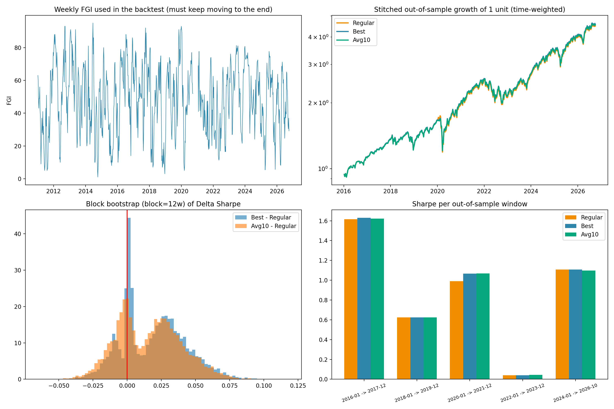
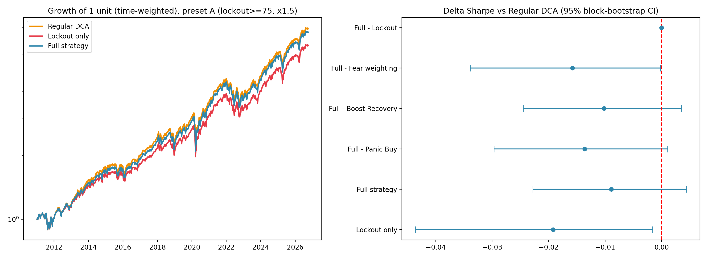

# Fear-Greed-Index-Weighted-Dollar-Cost-Averaging

Backtest of a **Fear & Greed Index (FGI)-weighted dollar-cost averaging (DCA)** strategy on the S&P 500 (SPY), compared with regular DCA.
Code for a school STEM project.

> **สรุปภาษาไทย:** โปรเจกต์นี้ทดสอบย้อนหลังว่าการปรับเงินลงทุนรายสัปดาห์ตามดัชนี CNN Fear & Greed (ซื้อเพิ่มตอนกลัว งดซื้อตอนโลภ) ให้ผลตอบแทนปรับความเสี่ยงดีกว่า DCA ปกติหรือไม่
> ผลคือ **ไม่พบความได้เปรียบอย่างมีนัยสำคัญทางสถิติ** (ดูหัวข้อ Results) ข้อมูลและวิธีการทั้งหมดทำซ้ำได้ด้วยสคริปต์ `fgi_dca_v2.py`

**Disclaimer:** educational project, not financial advice. Backtest results do not predict future returns.

---

## What it does

Every week the investor has a budget of **$1,000**. The strategy scales it by a multiplier `R` built from the FGI:

| Component | Rule |
|---|---|
| Fear weighting | FGI < `s`: invest more |
| Greed Lockout | FGI ≥ `s + w + 10`: invest nothing (tapers between `s + w` and `s + w + 10`) |
| Panic Buy | FGI < `P_thr`: multiply by `P_mult` |
| Boost Recovery | FGI crosses back above `P_thr`: multiply by `B_mult` |

Main setting is **capital-constrained**: money not invested stays in cash (earning the T-bill rate) and can be spent later, so extra buying in fear is funded only by cash saved earlier. An unconstrained variant (extra money can be added) is also tested.

## Method

- **Data:** weekly (Friday) SPY adjusted close, 3-month T-bill (`^IRX`), FGI.
- **Returns:** time-weighted, so weekly contributions do not count as returns. Transaction costs: 0.02% slippage + $0.005/share commission.
- **Parameter selection:** nested walk-forward. Parameters are chosen on the training period only (expanding window from 2011), then tested on 5 non-overlapping test windows (2016–17, 2018–19, 2020–21, 2022–23, 2024–26). Grid: 1,260 combinations.
- **Statistics:** block bootstrap (12-week blocks, 10,000 resamples) of the Sharpe-ratio difference, adapted from Ledoit & Wolf (2008) (simple percentile CI, not studentized). Paired t-test and Wilcoxon on weekly returns are reported but the bootstrap is the primary test.
- **Ablation:** parameters fixed in advance from CNN's zones (not optimized), removing one component at a time.

## Data sources

| Data | Source | Notes |
|---|---|---|
| SPY, `^IRX` | Yahoo Finance via `yfinance` | unofficial API |
| FGI 2011-01-03 → 2020-09-18 | [hackingthemarkets/sentiment-fear-and-greed](https://github.com/hackingthemarkets/sentiment-fear-and-greed) | |
| FGI 2021-01-01 → present | CNN's public graph data endpoint | unofficial, may change or block requests |

**Known data issue:** CNN's endpoint returns placeholder values for 2020-09-19 → 2020-12-31 (a ramp from ~0 then a constant 50.0). These are removed, plus any run of ≥ 5 identical daily values. In weeks without an FGI value the strategy invests like regular DCA (16 of 822 weeks). The two FGI sources may use slightly different calculations.

Raw FGI data is **not** included in this repo (`fgi_cache.csv` is git-ignored); the script downloads it.

## Install & run

Tested with Python 3.11.

```bash
pip install -r requirements.txt

python fgi_dca_v2.py            # data check + walk-forward + bootstrap + ablation
python fgi_dca_v2.py ablation   # ablation only
```

The script prints a per-year table of the FGI first. **Check it**: very low `unique` counts or many `missing` weeks mean the data download went wrong.

Outputs (written to the working directory):

| File | Content |
|---|---|
| `wf_windows_v2.csv` | Per-window Sharpe, chosen parameters |
| `constraint_comparison_v2.csv` | Constrained vs unconstrained |
| `ablation_results.csv` | Ablation for presets A, B, C |
| `fgi_dca_v2_results.png`, `fgi_dca_ablation.png` | Figures |
| `fgi_cache.csv` | Downloaded FGI cache (git-ignored) |

Bootstrap seed is fixed (`SEED = 42`). Results can still change if the upstream data sources are revised.

## Results (2011–2026 data, out-of-sample 2016–2026)

| | Regular DCA | FGI-DCA (Best) |
|---|---|---|
| Sharpe | 0.785 | 0.806 |
| Max drawdown | −31.8% | −28.5% |
| ΔSharpe (95% CI) | – | +0.021 [−0.021, +0.066], bootstrap p = 0.34 |

- **No statistically significant improvement** over regular DCA.
- The optimizer picked the largest `s`, `w`, `P_thr` in the grid in every window, meaning it preferred almost no Greed Lockout.
- Ablation: Greed Lockout alone lowered final value per dollar invested by about 10% (3.203 vs 3.557) and made drawdowns shallower. The buy-back components recovered about 87% of that loss. No variant beat regular DCA on Sharpe.
- Capital-constrained FGI-DCA ended within $25 of regular DCA (about $2.92M each); the unconstrained variant simply invested about 34% more money.




## Limitations

- One asset (SPY), mostly a bull market; the 2008 crisis is not covered.
- 16 weeks of FGI data missing and two FGI sources joined in 2021.
- Constrained vs unconstrained comparison and ablation use the full sample with fixed parameters (not out-of-sample fitting).
- The weekly return difference between strategies is tiny, so the test has low power: a true effect below about 0.04 Sharpe cannot be separated from zero.
- Simplified transaction costs; no taxes; no lagging of the FGI signal.

## Report

The full write-up (Thai) is in `report/` *(add the PDF here)*.

## References

- Ledoit, O., & Wolf, M. (2008). Robust performance hypothesis testing with the Sharpe ratio. *Journal of Empirical Finance, 15*(5), 850–859.
- Lim, T., & Ong, S. (2023). Weighted and pure dollar-cost averaging strategies in various asset classes. *IRC-SET 2023*, 71–83.
- Kapalczynski, A., & Lien, D. (2021). Effectiveness of augmented dollar-cost averaging. *North American Journal of Economics and Finance, 56*, 101370.

See the report for the complete list.

## License

MIT (code only). Market data belongs to its respective providers.
